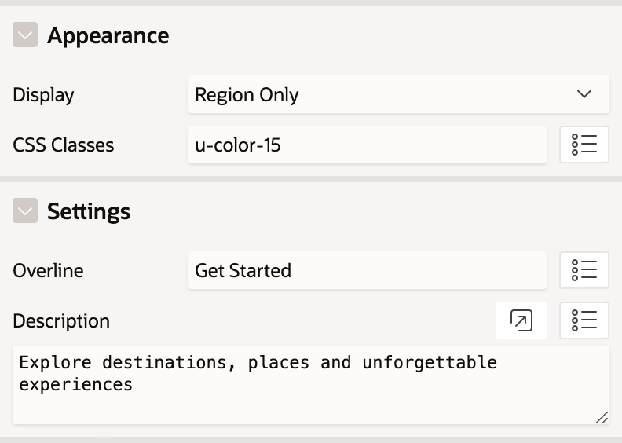

# Hero Template Component
A richer Hero template component, that will allow you to bring a little extra eye candy to your applications. This was built around the Oracle APEX 24.1 feature set, using slots and controls, as well as template components as region only. This was also originally developed for Kscope 2024 conference with the Timplating session.

## Features
* Overline, Region Title and Description text attributes
* Search field, with category and action slots
* Theme roller support, Vita, Vita Dark and Redwood Light
* Supports Youtube Embed Template Component to use as Back Drop

## Installation
Import template_component_plugin_hero.sql into your applicaiton. Optionally import the [Youtube Embed](https://github.com/Vastyles/timplating-youtube-embed) template component if you wish you have a backdrop vieo.

## Sample Config

**Hero**

**Hero Attributes**

**(Optional) Youtube Embed Template Component Attributes**

## Preview

## Demo
[APEX Escapes](https://apex.oracle.com/pls/apex/r/timplating/apex-escapes/)
